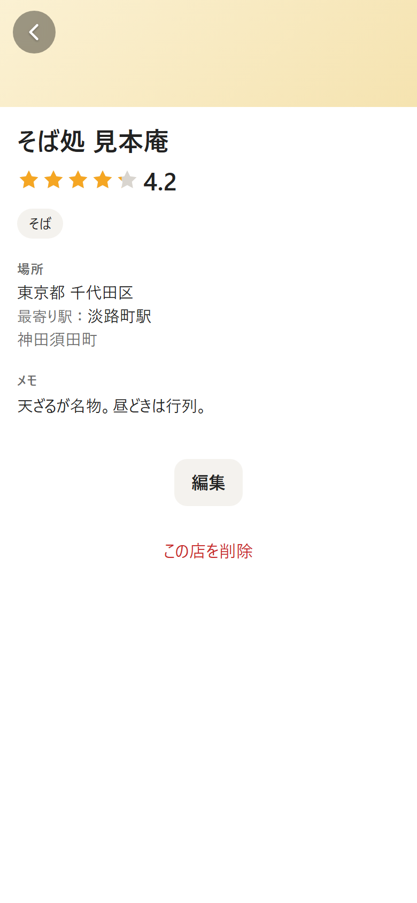

# 工事07b 報告 — 駅まわりの小直し2点（同じ県の同名の駅を足さない／店ページの「最寄り駅：」表記）

- 日付: 2026-09-27
- 実装役: Claude Code（Opus 5.5）
- **状態: 機能完成（実機確認待ち）**。花井さんの iPhone 確認が通れば、相談役が「実装完了」を判定します
- ブランチ: `work/07b-station-fixes`（origin に push 済み）
- **公開済み**: https://oukauog.github.io/gourmet-card/ 、版 **`6d7de3c`**

---

## 1. 前作業の結果

| 手順 | 結果 |
|---|---|
| 0-1 作業ツリー確認 | 差分は `docs/01_仕様書.md`（変更、v0.14）と `docs/工事07b_依頼文.md`（未追跡）の2つだけで、想定どおり |
| 0-1 コミット・push | `work/07a-station-names` 上で `docs: update spec to v0.14 and add construction 07b request`（`1f04a4a`）をコミットし、push した |
| 0-2 stash の確認 | 残っていた stash は1つ（`WIP on work/07a-station-names: a889218 …`）。確かめたことは下の3つ ・変えていたのは `scripts/build-geo-data.mjs` と `src/data/stations.json` の2ファイルだけ（`git stash show --stat`）。未追跡ファイルの部分は無し（`stash^3` が無い） ・`git diff stash@{0} fb5c731 -- <2ファイル>` の差分が空 ・2ファイルの blob のハッシュが、stash・`fb5c731`・HEAD で同じ（`git rev-parse stash@{0}:<file>` 等。`aa056c7…`・`fe7ceae…`） → 中身は工事7a のコミットに入っているので `git stash drop` で削除した この stash は、工事7a の途中で私が生成物の差分を確かめるために `git stash` → `git stash apply` をして、drop し忘れたものです |
| 0-3 main へマージ | `git merge --ff-only work/07a-station-names` で fast-forward（`108cec2..1f04a4a`）→ `git push origin main` 成功 |
| ブランチ削除 | リモートの `work/07a-station-names` を削除、ローカルも削除。`gh-pages` は残している |
| 0-4 新ブランチ | main（`1f04a4a`）から `work/07b-station-fixes` を作成 |

## 2. やったこと

- **1-1 駅マスタ**
  - 代表と違う名前の駅を足す時、同じ県に同じ名前（`nameKey` で比較）の駅が既にあれば足さないようにした
  - 足す候補をいったん全部集め、全グループの代表がそろってから判定する2段の作りに変えた
  - 足す駅どうしで重なる時は、駅コードの小さい方を残す（今回は該当なし）
- **1-2 店ページ**: 場所の欄の駅の行を「最寄り駅：淡路町駅」にした
- **1-3 テスト**
  - 工事7a で足した 200駅の控えを作った
  - 残す 197駅の不変と、外した3駅のテストを足した
  - 件数の期待値を直した
  - e2e の店ページの確認に「最寄り駅：淡路町駅」を足した
- **1-4 公開**: `npm run deploy`（版 `6d7de3c`）

### 既存ファイルの編集方法（B-1）
- 既存ファイルは、これまでと同じ Node スクリプトで編集した（置き換え元が1か所だけかを確かめ、合わなければ何も書かずに止まる）
- 書き込みの後に `typecheck`・`test` を続けて実行した
- 生成物は `npm run geo-data` で作り直した

## 3. 作成・変更ファイル一覧

### 新規

| ファイル | 役割 |
|---|---|
| `src/lib/fixtures/stations-added-07a.json` | 工事7a で足した 200駅の控え（`[id, 名前, 県, 市]`）。197駅の不変を確かめるため。工事7a の生成物から作った |
| `reports/工事07b_画面/01-shop-place.png` | 店ページの場所の欄（390×844） |

### 変更（理由つき）

| ファイル | 変更箇所と理由 |
|---|---|
| `scripts/build-geo-data.mjs` | 1-1。別の名前の駅は、グループのループの中では候補に集めるだけにした。ループの後、同じ県・同じ名前（`nameKey`）の駅が既にあるものを外して足す 外した駅は `--report` の `skippedAliases` に出る 代表の選び方・市の決め方・補足表・出力の形は変えていない |
| `src/data/stations.json` | 生成し直した（3行が減っただけ） |
| `src/screens/ShopScreen.tsx` | 1-2。駅の行を ``（`最寄り駅：` の `` と、駅名の ``）にした |
| `src/styles/shop.css` | `.shop-station-label`（灰色 `--c-sub`・14px）を1つ足した |
| `src/lib/geo.names.test.ts` | 件数の期待値を直した（6章）。工事7b のテスト2件を足した |
| `e2e/station.spec.ts` | 淡路町のテストに「最寄り駅：淡路町駅」の確認を足した。駅だけの店の場所の欄の期待値を直した（6章） |

変更していないもの:
- `src/db/`
- 候補の並び・正規化・自動補完・絞り込み
- フォームの駅の表示、パネル・チップ
- 県・市の行とエリアの行
- `cities.json`
- `data-src/`
- `reports/工事07a_足した駅.md`（工事7a の記録として残した）
- 仕様書・CLAUDE.md・依頼文

## 4. 生成結果

| 段階 | 件数 |
|---|---|
| 工事7a の合計 | 8,983 |
| 別の名前の駅 | 200 → **197**（外した駅 **3**） |
| 合計 | **8,980**（見込みどおり） |

**外した3駅**（いずれも同じ県の**代表の駅**と同じ名前。足す駅どうしの重なりは 0件）

| id | 名前 | 県 | 市 | 同じグループの代表 | 同じ名前の既存の駅（残る） |
|---|---|---|---|---|---|
| 9921410 | 仙台 | 宮城県 | 仙台市 | あおば通 | `1123143` 仙台（宮城県仙台市） |
| 3500103 | 野田 | 大阪府 | 大阪市 | 海老江 | `1162308` 野田（大阪府大阪市） |
| 9962113 | 高井田 | 大阪府 | 東大阪市 | 高井田中央 | `1160711` 高井田（大阪府**柏原市**） |

**工事7a の報告の訂正**
- 工事7a 報告 7章1 で「3駅とも同じ市に同じ名前の駅がもう1つある」と書きましたが、**高井田は違いました**
  - 残る高井田（`1160711`、JR）は柏原市、外した高井田（大阪メトロ）は東大阪市です
  - 同じ県の同名という今回のルールには当たるので外しています
  - 外した高井田は、同じグループの代表「高井田中央」（東大阪市）のすぐ隣の駅です。その辺りの店は「高井田中央」で登録できます
  - テストもこの実データに合わせて、「大阪府の高井田は柏原市の1駅」「高井田中央は東大阪市」を確かめています

**その他**
- 同じ名前の駅の数: 415 → 412（同じ県に2つ以上ある名前 49 → 46、別の県にもある名前 377 のまま）
- 住所から市が決まらない駅は 0件のまま
- 補足表は今までどおり17駅を足した（奥津軽いまべつは足さない）

**生成物のサイズ**

| ファイル | 工事7a | 工事7b |
|---|---|---|
| `src/data/stations.json` | 246,573 バイト | 246,497 バイト |
| ビルド後の駅マスタ `stations-*.js` | 237,536 バイト（gzip 77.0 kB） | 237,463 バイト（gzip 77.0 kB） |

## 5. 店ページの駅の行

- 場所の欄の中身（上から）
  1. 「東京都 千代田区」（変更なし）
  2. 「**最寄り駅：淡路町駅**」
  3. 「神田須田町」（エリア。変更なし）
- **「最寄り駅：」**
  - 色は灰色 `--c-sub`（#6b6b6b。エリアの行と同じ色）
  - 大きさは 14px。駅名は 15px のままで、同じ行に並ぶ
  - 「：」は全角
- **駅名**: `stationLabel` の結果のまま（黒・15px）
- マスタに無い駅 ID の時は、行ごと出さない（今までどおり）
- スクリーンショットの店は撮影用の架空の店です。撮影用の手順は一時ファイルで実行し、削除しました

## 6. 既存テストで直した箇所

| ファイル | 箇所 | 変更前 | 変更後 |
|---|---|---|---|
| `src/lib/geo.names.test.ts` | 「only additions …」 | 名前「200 stations of other names」、増えた駅 200、全体 8,983 | 名前「197 stations of other names (construction 7b: 200 - 3)」、増えた駅 197、全体 8,980 |
| `e2e/station.spec.ts` | 「unknown station id …; station only still has a place section」の駅だけの店 | 場所の欄の文字が `黒部宇奈月温泉駅` | `最寄り駅：黒部宇奈月温泉駅`（場所の欄全体の文字を比べているため） |

- ほかの既存テスト・e2e・e2e:dist は変更なしで通りました
- 駅名だけを確かめている確認（`.shop-station` が「富山駅」「高岡駅」「淡路町駅」）は、駅名の部分を同じ `.shop-station` のまま残したので変わっていません

## 7. 各コマンドの結果（最終コミット前にまとめて実行）

| コマンド | 結果 |
|---|---|
| `npm run typecheck` | 合格（エラー0） |
| `npm test` | 合格 **282件 / 282件**（27ファイル）＝工事7a の 280件＋2件 |
| `npm run e2e` | 合格 **51件 / 51件**（件数は同じ。1件に確認を足し、1件の期待値を直した） |
| `npm run e2e:dist` | 合格 **4件 / 4件**（変更なし） |
| `npm run build` | 成功。`index-*.js` 370.8 kB（gzip 117.2 kB）、`stations-*.js` 237.5 kB（gzip 77.0 kB）、`cities-*.js` 22.4 kB、CSS 18.0 kB |
| `npm run lint` | 合格（警告・エラー0） |
| `npm run geo-data` を2回続けて | **2回とも同じ**（`stations.json` の SHA-256 `2a860c73…25a156`） |

**`dist/` の検索**:「見本」（エスケープされた形も）・`DevSampleBar`・`addSampleShops` は**すべて 0件**

**回帰で比べた件数**
- 直す前（工事7）の **8,783駅すべて**が、同じ id・名前・県・市（工事7a の回帰テストがそのまま通った）
- 工事7a で足した200駅のうち、外した3駅以外の **197駅すべて**が、同じ id・名前・県・市
- 外した3駅（`9921410`・`3500103`・`9962113`）はマスタに無い

**足したテスト**
- `geo.names.test.ts`: 上の197駅・3駅の確認
- `geo.names.test.ts`: 仙台・野田・高井田が同じ県で1駅だけ
  - 「仙台」の候補に宮城県仙台市の仙台駅が1つ（`1123143`）
  - 大阪府の野田は大阪市の1駅（`1162308`）
  - 大阪府の高井田は柏原市の1駅（`1160711`）、高井田中央は東大阪市
- 工事7a のテスト（淡路町・小川町・日比谷・梅田・南富山駅前・電鉄富山・宇奈月・押上・富山など）は、件数の1か所以外そのまま通った
- e2e: 淡路町で保存した店ページに「最寄り駅：淡路町駅」

## 8. 公開の結果

| 項目 | 結果 |
|---|---|
| 公開した版 | **`6d7de3c`**（作業ツリーがクリーン・stash なしの状態で `npm run deploy`。`+` なし） |
| `gh-pages` のコミット | **`908b971`**（`Deploy 6d7de3c`）。Pages のビルドは `built` |
| 公開 URL の確認（`curl`） | `index.html` 200 `index-bnmAYII3.js` 200（版 `6d7de3c`、「最寄り駅：」あり） 駅マスタ `stations-DbO437g4.js` 200、237,463 バイト（外した3駅の id は 0件、残る仙台・野田・高井田の id は各1件、淡路町あり） |

## 9. 花井さんの iPhone 実機確認手順（公開 URL https://oukauog.github.io/gourmet-card/ で）

1. **版**: 登録画面の一番下の版が **`版 6d7de3c`** か（違えば数分待って再読み込み）
2. **仙台**: 最寄り駅に「仙台」→ 候補の宮城県の仙台駅が1つだけか
3. **店ページ**: 駅つきの店の店ページで、場所の欄が「最寄り駅：〇〇駅」になっているか。見え方が落ち着いているか
4. **工事7a の駅**: 淡路町・小川町など工事7a の駅が今までどおり出るか

## 10. ブランチとコミット

ブランチ `work/07b-station-fixes`（origin に push 済み）

| コミット | 内容 |
|---|---|
| `1f04a4a` | docs: update spec to v0.14 and add construction 07b request（= main の先頭） |
| `af4b722` | fix(geo): do not add an other name when the prefecture already has a station of that name (仙台, 野田, 高井田) |
| `d2437cc` | feat(shop): station line reads 最寄り駅：<name> |
| `6d7de3c` | docs: construction 07b screenshot ← **公開した版** |
| （この報告のコミット） | docs: add construction 07b report — 最終コミット。公開し直していない（アプリの中身は `6d7de3c` と同じ） |

`gh-pages`: **`908b971`**（Deploy 6d7de3c）

## 11. 保留・質問

1. **高井田**（4章）: 外した大阪メトロの高井田（東大阪市）の辺りの店は「高井田中央」で登録することになります。JR の高井田（柏原市）とは離れた駅なので、「高井田」と打って柏原市の駅が出た時に選び間違える可能性はあります（所在地「大阪府柏原市」は候補に出ます）。このままで良いか確認をお願いします
2. **仙台・野田・高井田で登録した店**: 仕様書どおり「無い前提」です。もしあれば、その店の駅は「（見つからない駅）」になります。フォームの × で外して、選び直せます
